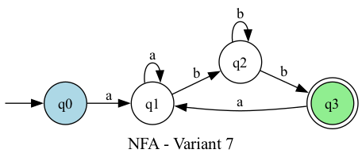
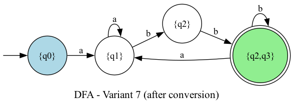

# Lab 2: Determinism in Finite Automata. Conversion from NDFA to DFA. Chomsky Hierarchy.

### Course: Formal Languages & Finite Automata

### Author: Cătălin Bîtca

---

## Theory

A finite automaton (FA) is a computational model consisting of states, an alphabet, transitions, a start state, and a set of final (accepting) states. An FA is **deterministic (DFA)** if for every state and input symbol there is exactly one transition. If any state has multiple transitions on the same symbol, the FA is **non-deterministic (NDFA)**.

The **Chomsky hierarchy** classifies formal grammars into four types:

- **Type 0** (Unrestricted) — no restrictions on production rules
- **Type 1** (Context-Sensitive) — productions satisfy |α| ≤ |β|
- **Type 2** (Context-Free) — left-hand side is a single non-terminal
- **Type 3** (Regular) — productions are of the form A → aB or A → a (right-linear)

Any NDFA can be converted to an equivalent DFA using the **subset construction algorithm**, where each DFA state corresponds to a set of NFA states.

## Objectives

1. Provide a function in the grammar class that classifies the grammar based on Chomsky hierarchy.
2. Implement conversion of a finite automaton to a regular grammar.
3. Determine whether the FA is deterministic or non-deterministic.
4. Implement NDFA to DFA conversion.
5. Represent the finite automaton graphically.

## Variant 7 — FA Definition

```
Q = {q0, q1, q2, q3}
Σ = {a, b}
F = {q3}
δ(q0, a) = q1
δ(q1, b) = q2
δ(q2, b) = q3
δ(q3, a) = q1
δ(q2, b) = q2
δ(q1, a) = q1
```

Note: δ(q2, b) maps to both q2 and q3, making this an **NDFA**.

## Implementation Description

### Chomsky Classification (`Grammar.classify_chomsky`)

The method iterates over all productions and checks whether each follows the right-linear pattern (A → aB or A → a). If all productions conform, the grammar is Type 3 (Regular). If the left-hand side is always a single non-terminal but the right-hand side doesn't match regular form, it's Type 2 (Context-Free). If the left-hand side is not a valid non-terminal, it falls to Type 0.

```python
def classify_chomsky(self):
    is_right_linear = True
    for left, rights in self.productions.items():
        if left not in self.vn:
            return "Type 0 (Unrestricted)"
        for right in rights:
            if len(right) == 0:
                continue
            elif len(right) == 1:
                if right[0] not in self.vt:
                    is_right_linear = False
            elif len(right) == 2:
                if not (right[0] in self.vt and right[1] in self.vn):
                    is_right_linear = False
            else:
                is_right_linear = False
    if is_right_linear:
        return "Type 3 (Regular)"
    return "Type 2 (Context-Free)"
```

### FA to Regular Grammar (`FiniteAutomaton.to_regular_grammar`)

Each state becomes a non-terminal and each transition δ(q, a) = p produces the rule q → ap. Additionally, if p is a final state, we also add q → a so the derivation can terminate at that point.

```python
def to_regular_grammar(self):
    from grammar import Grammar
    vn = set(self.states)
    vt = set(self.alphabet)
    productions = {}
    for state in self.states:
        prods = []
        for symbol in sorted(self.alphabet):
            targets = self.transitions.get(state, {}).get(symbol, set())
            for target in sorted(targets):
                prods.append([symbol, target])
                if target in self.final_states:
                    prods.append([symbol])
        productions[state] = prods
    return Grammar(vn, vt, productions, self.start_state)
```

### Determinism Check (`FiniteAutomaton.is_deterministic`)

Checks all states: if any state has more than one target for the same input symbol, the FA is non-deterministic. In Variant 7, state q2 on input 'b' transitions to both q2 and q3, so the check returns False.

```python
def is_deterministic(self):
    for state in self.states:
        for symbol in self.alphabet:
            targets = self.transitions.get(state, {}).get(symbol, set())
            if len(targets) > 1:
                return False
    return True
```

### NDFA to DFA Conversion (`FiniteAutomaton.ndfa_to_dfa`)

Uses the subset construction algorithm. Starting from {q0}, for each composite state and each symbol, the algorithm computes the union of all reachable NFA states. Each unique set becomes a new DFA state. A DFA state is final if it contains any NFA final state.

```python
def ndfa_to_dfa(self):
    from collections import deque

    def state_name(state_set):
        return "{" + ",".join(sorted(state_set)) + "}"

    start = frozenset([self.start_state])
    queue = deque([start])
    visited = {start}
    dfa_transitions = {}
    dfa_final = set()

    while queue:
        current = queue.popleft()
        name = state_name(current)
        dfa_transitions[name] = {}
        for symbol in sorted(self.alphabet):
            next_set = set()
            for s in current:
                next_set.update(self.transitions.get(s, {}).get(symbol, set()))
            if next_set:
                nf = frozenset(next_set)
                nn = state_name(nf)
                dfa_transitions[name][symbol] = {nn}
                if nf not in visited:
                    visited.add(nf)
                    queue.append(nf)
        if current & self.final_states:
            dfa_final.add(name)

    dfa_states = {state_name(s) for s in visited}
    return FiniteAutomaton(dfa_states, self.alphabet, dfa_transitions,
                           state_name(start), dfa_final)
```

### Graphical Representation (`FiniteAutomaton.draw_graph`)

Uses the `graphviz` library to render the automaton. Start states are colored light blue, final states are green with double circles, and transitions between the same pair of states are merged into a single edge with comma-separated labels.

## Results

**Lab 1 Grammar Classification:** Type 3 (Regular) — all productions are right-linear.

**FA to Regular Grammar — resulting productions:**

```
q0 -> aq1
q1 -> aq1
q1 -> bq2
q2 -> bq2
q2 -> bq3
q2 -> b
q3 -> aq1
```

Classification: Type 3 (Regular).

**Determinism Check:** The FA is **non-deterministic** — δ(q2, b) = {q2, q3}.

**NDFA to DFA Conversion:**

| DFA State | on 'a' | on 'b'  |
| --------- | ------ | ------- |
| {q0}      | {q1}   | —       |
| {q1}      | {q1}   | {q2}    |
| {q2}      | —      | {q2,q3} |
| {q2,q3}   | {q1}   | {q2,q3} |

Start state: {q0}. Final states: {q2,q3}. The resulting DFA is **deterministic**.

**String Testing (NFA and DFA produce identical results):**

| String  | Accepted |
| ------- | -------- |
| abb     | Yes      |
| abbb    | Yes      |
| aabb    | Yes      |
| abbabb  | Yes      |
| ab      | No       |
| a       | No       |
| b       | No       |
| abba    | No       |
| abbabbb | Yes      |

**NFA Graph:**



**DFA Graph (after conversion):**



## Conclusions

The Variant 7 finite automaton is non-deterministic because state q2 has two possible transitions on input 'b'. Using the subset construction algorithm, it was converted to an equivalent DFA with 4 states ({q0}, {q1}, {q2}, {q2,q3}), where {q2,q3} is the only accepting state. Both automata accept the same language — strings matching the pattern a(a)*b(b)*b followed by optional repetitions via the q3→q1 loop. The converted regular grammar is Type 3 (right-linear), confirming the language is regular.

## References

- Course materials: Formal Languages & Finite Automata, TUM
