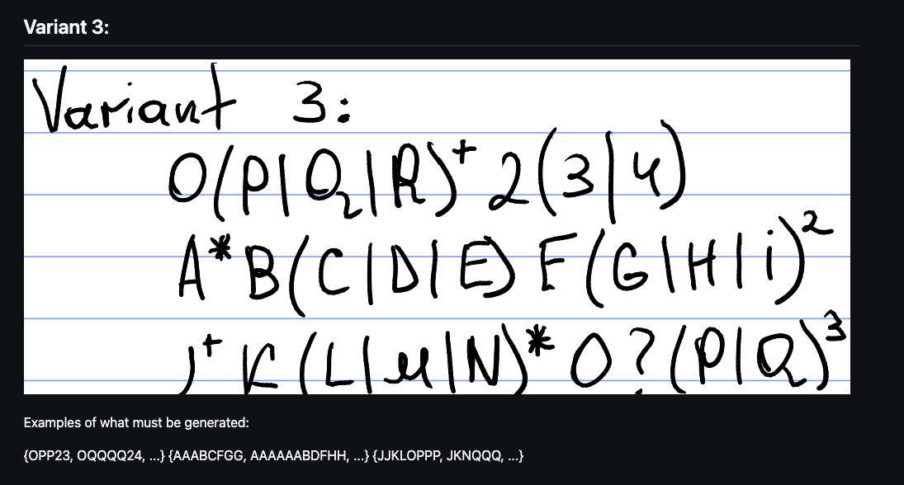

# Lab 4: Regular Expressions and Word Generation (Variant 3)

### Course: Formal Languages & Finite Automata

### Author: Catalin Bitca

---

## Theory

A **regular expression (regex)** is a compact formal notation used to describe a set of strings over an alphabet. Regular expressions are equivalent in expressive power to finite automata and regular grammars (Type 3 in the Chomsky hierarchy), so every regex describes a regular language.

In practical terms, regular expressions are used to:

- validate text patterns (emails, identifiers, formats),
- search and extract structured fragments from text,
- define token patterns for lexical analysis,
- generate strings that belong to a formal language.

Core regex operations used in this lab:

- **Concatenation**: `AB` means symbol `A` followed by symbol `B`.
- **Union / Alternation**: `A|B` means either `A` or `B`.
- **Kleene star**: `A*` means zero or more repetitions of `A`.
- **Plus**: `A+` means one or more repetitions of `A`.
- **Optional**: `A?` means zero or one occurrence of `A`.
- **Exponent**: `A^n` means exactly `n` repetitions of `A`.
- **Grouping**: `( ... )` controls precedence and scope of operators.

Because `*` and `+` are unbounded, the lab requirement imposes a practical generation cap: maximum **5 repetitions** for unbounded constructs.

---

## Objectives

1. Explain what regular expressions are and what they are used for.
2. Implement dynamic generation of valid words for given regular expressions (without hardcoding generation logic per regex).
3. Apply repetition cap of 5 for unbounded repetition operators.
4. Implement bonus functionality to show processing sequence of regex handling.
5. Document implementation details, results, and difficulties.

---

## Variant 3

Given regex set:

1. `O(P|Q|R)+2(3|4)`
2. `A*B(C|D|E)F(G|H|I)^2`
3. `J+K(L|M|N)*O?(P|Q)^3`

Task image:



---

## Implementation Description

The implementation is located in:

- `Lab4/src/regex_engine.py`
- `Lab4/src/main.py`

### 1. Dynamic Parsing to AST

A custom recursive-descent parser is implemented for a general regex subset. It converts input regex into an Abstract Syntax Tree (AST), with node types:

- `Literal`
- `Concat`
- `UnionNode`
- `Repeat`

Parser supports:

- grouping with `(` and `)`
- alternation `|`
- implicit concatenation
- postfix operators `*`, `+`, `?`, `^n`

This satisfies the dynamic requirement: regexes are interpreted structurally at runtime, not hardcoded.

### 2. Word Generation from AST

The generator recursively expands AST nodes:

- `Literal` -> returns its symbol
- `UnionNode` -> combines expansions from all branches
- `Concat` -> Cartesian product of part expansions
- `Repeat` -> repeated concatenation between min/max bounds

For unbounded repetition (`*`, `+`), upper bound is replaced by configurable cap (`max_unbounded_repetitions=5`).

### 3. Bonus: Processing Sequence Trace

During parsing, each operation appends a human-readable step (read literal, enter group, apply operator, build concatenation, etc.).

Using `--show-steps`, the program prints exact processing order for each regex.

### 4. CLI Interface

`main.py` supports:

- default Variant 3 regex set (if no input provided),
- custom input regexes via repeated `--regex`,
- configurable unbounded repetition cap via `--max-repeat`,
- configurable number of shown examples via `--limit`,
- optional processing trace via `--show-steps`.

---

## Code Snippets

### Parser Entry

```python
class RegexParser:
    def parse(self):
        self._step(f"Start parsing: {self.pattern}")
        node = self._parse_expression()
        if self._current() is not None:
            raise ValueError(f"Unexpected symbol '{self._current()}' at position {self.pos}")
        self._step("Parsing finished")
        return node
```

### Repeat Expansion with Cap

```python
if isinstance(node, Repeat):
    max_times = node.max_times
    if max_times is None:
        max_times = self.max_unbounded_repetitions

    result = []
    subwords = self._expand(node.node)
    for count in range(node.min_times, max_times + 1):
        if count == 0:
            result.append("")
            continue
        pools = [subwords] * count
        for combo in product(*pools):
            result.append("".join(combo))
    return result
```

### Main Execution

```python
generator = RegexGenerator(max_unbounded_repetitions=args.max_repeat)
for regex in regexes:
    words, steps = generator.generate(regex, limit=None)
    shown_words = pick_evenly(words, args.limit)
    print(format_set_preview(shown_words))
```

---

## Execution and Results

Command used:

```bash
cd Lab4/src
python3 main.py --limit 10
```

Observed output summary:

- Regex 1 (`O(P|Q|R)+2(3|4)`) -> total generated words: **726**
- Regex 2 (`A*B(C|D|E)F(G|H|I)^2`) -> total generated words: **162**
- Regex 3 (`J+K(L|M|N)*O?(P|Q)^3`) -> total generated words: **29120**

All required sample patterns are generated (validated in output):

- Regex 1: includes `OPP23`, `OQQQQ24`
- Regex 2: includes `AAABCFGG`, `AAAAABDFHH` (5-A cap respected)
- Regex 3: includes `JJKLOPPP`, `JKNQQQ`

Bonus requirement is satisfied through:

```bash
python3 main.py --show-steps --limit 20
```

which prints ordered parsing steps for each expression.

---

## Difficulties Encountered

1. **Operator precedence and associativity**

Handling precedence correctly (`|` lower than concatenation, postfix operators highest) required careful parser structure.

2. **Implicit concatenation**

Concatenation is not represented by a symbol in regex syntax, so the parser had to infer term boundaries from context.

3. **Controlling combinatorial explosion**

Expressions with multiple repeats can produce very large sets. The 5-repetition cap for unbounded operators was essential to keep generation feasible.

4. **Maintaining dynamic behavior**

A temptation was to tailor logic specifically for Variant 3 examples. Instead, a generic parser + AST + expander was implemented so new regexes can be added without code redesign.

---

## Conclusion

This lab implements a dynamic regular-expression engine that parses regexes into an AST and generates valid words from structure rather than from hardcoded templates. The implementation supports all required operators for the assignment, enforces the repetition cap for unbounded constructs, and includes a trace mode that shows the processing sequence step-by-step. Variant 3 expressions were successfully processed, and valid outputs were generated according to the formal definitions.

## References

- Course materials: Formal Languages & Finite Automata, TUM
- Python documentation: `itertools.product`
